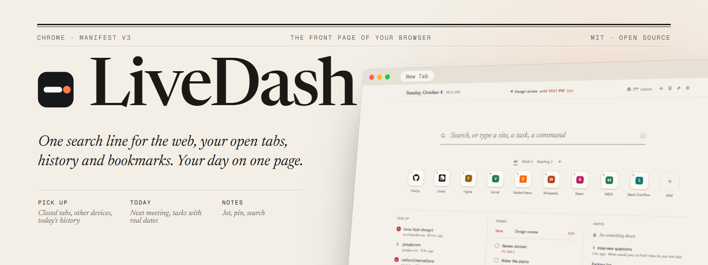
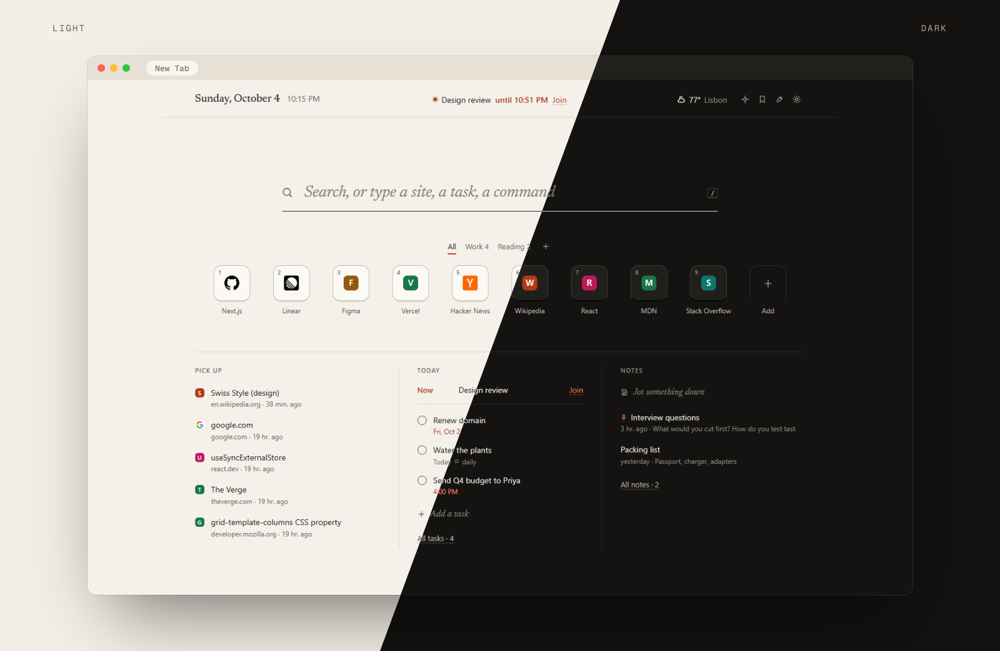
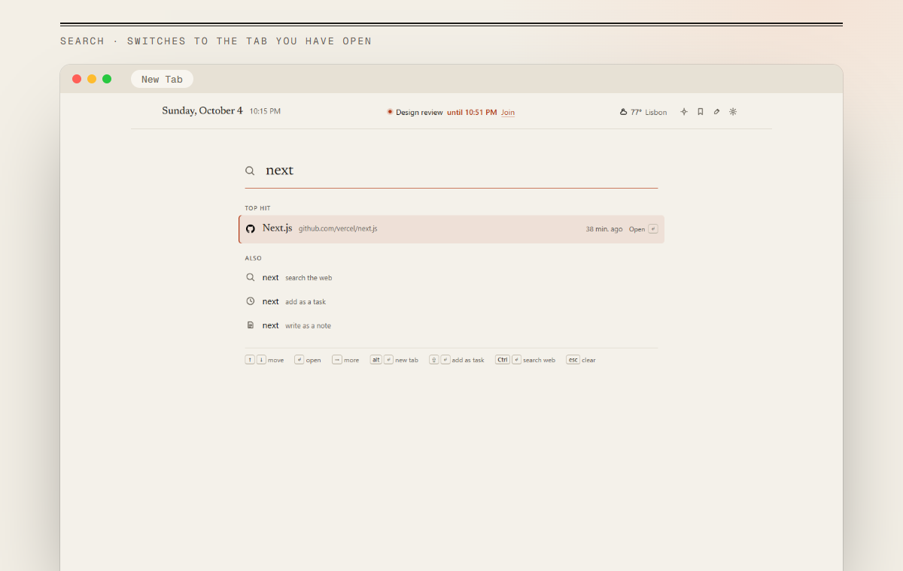
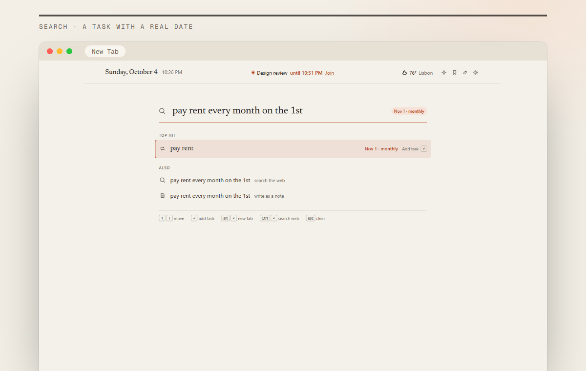
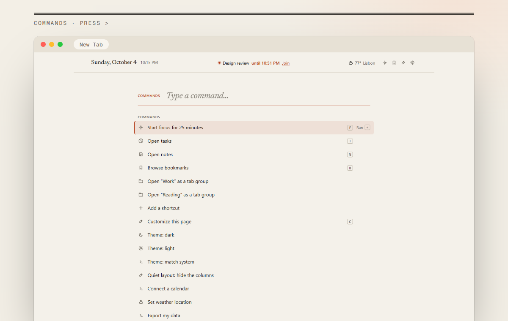
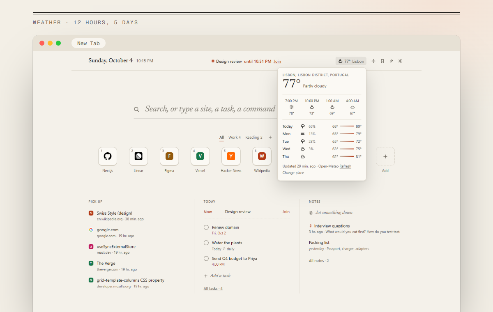
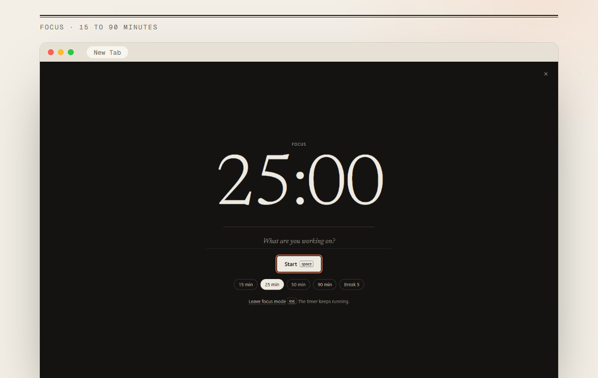
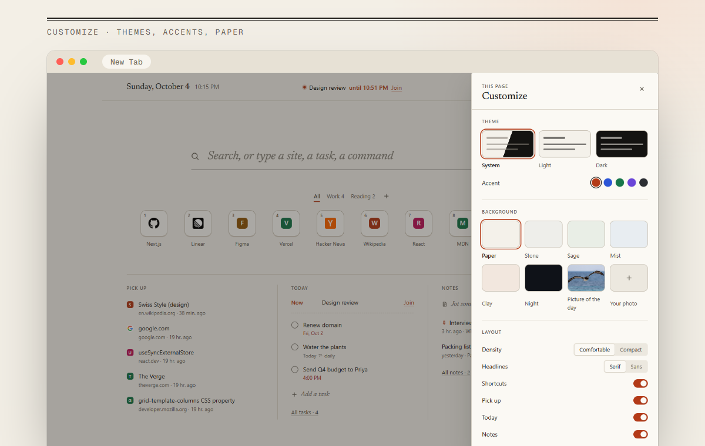

<picture>
  <source media="(prefers-color-scheme: dark)" srcset=".github/assets/cover-dark.png">
  
</picture>

<p align="center">
  <a href="https://github.com/Mahan-Imanian/LiveDash/actions/workflows/ci.yml"></a>
  <a href="LICENSE"></a>
  
  
</p>

<p align="center">
  <a href="#install"><b>Install</b></a> ·
  <a href="#search">Search</a> ·
  <a href="#shortcut-keys">Shortcuts</a> ·
  <a href="#today">Today</a> ·
  <a href="#keys">Keys</a> ·
  <a href="#privacy">Privacy</a>
</p>

<br>



A new tab should get you somewhere. LiveDash's search box knows which tabs you have open, what you visit at this hour and what you bookmarked, and ranks those above a web search. Under it sit the shortcuts you use most, what you closed by accident, today's tasks and meeting, and your notes. Nothing else.

## Search

Type two letters. If the page is already open in a tab, the top hit switches to it instead of opening a duplicate. Otherwise it's the site you usually visit at this hour, or a bookmark. A full address opens directly, `yt jazz` or `w typography` goes straight to that site, and anything else goes to the engine you chose. Type "call mom friday 6pm" and press <kbd>⇧</kbd> <kbd>↵</kbd> to file it as a task.

<p align="center">
  
  
</p>

## Shortcut keys

Nine numbered keys, opened with <kbd>Alt</kbd> <kbd>1</kbd>…<kbd>9</kbd>, and as many unnumbered ones as you want. Sort them into groups, drag them around, give them your own icon or a coloured letter, and open a whole group as a Chrome tab group. Empty slots don't stay empty: LiveDash suggests sites from your history as faded keys, and you can dismiss any of them.

## Today

The next meeting with its join link sits at the top of the page once you paste your calendar's secret iCal link into **Settings → Calendar**. Below it are tasks written the way you'd say them, "pay rent every month on the 1st" or "call mom friday 6pm", with overdue ones marked, undo on every completion, and repeating ones rolling forward on their own. Next to it, **Pick up** lists tabs you closed, pages open on your other devices and today's history without the noise (search results, sign-in pages, errors), and **Notes** holds whatever you jotted.

## Everything else is one key away

<kbd>></kbd> opens a command list for themes, focus, reopening, closing duplicates and exporting. <kbd>?</kbd> shows every key. Weather, a focus timer and a picture of the day are there if you switch them on, and Customize covers light, dark or system, five accents, six paper tones, density, serif or sans headlines and a switch for every column.

<p align="center">
  
  
</p>
<p align="center">
  
  
</p>

## Install

LiveDash isn't on the Chrome Web Store, so you build it once and load it unpacked. You need Chrome 120+ and Node.js 22.18+.

```bash
git clone https://github.com/Mahan-Imanian/LiveDash.git
cd LiveDash
npm ci
npm run build
```

Open `chrome://extensions`, turn on **Developer mode**, choose **Load unpacked** and select `.output/chrome-mv3`, then open a new tab. `npm run zip` builds a packed copy at `.output/livedash-<version>-chrome.zip`.

## Keys

| Action | Key |
| --- | --- |
| Search from anywhere on the page | <kbd>/</kbd> |
| Commands | <kbd>></kbd> |
| Open shortcut 1–9 | <kbd>Alt</kbd> <kbd>1</kbd>…<kbd>9</kbd> |
| Open a result in a new tab | <kbd>Alt</kbd> <kbd>↵</kbd> |
| Add what you typed as a task | <kbd>⇧</kbd> <kbd>↵</kbd> |
| Search the web for what you typed | <kbd>Ctrl</kbd> <kbd>↵</kbd> |
| More actions for a result or shortcut | <kbd>→</kbd> or right-click |
| Focus mode · Bookmarks · Tasks · Notes | <kbd>F</kbd> · <kbd>B</kbd> · <kbd>T</kbd> · <kbd>N</kbd> |
| Customize · Settings · All keys | <kbd>C</kbd> · <kbd>,</kbd> · <kbd>?</kbd> |
| Undo | <kbd>Ctrl</kbd> <kbd>Z</kbd> |
| Quick capture on any page | <kbd>Alt</kbd> <kbd>Shift</kbd> <kbd>L</kbd> |

Single-letter keys work when the cursor isn't in a text box. Press <kbd>Esc</kbd> first.

## Privacy

No account, no server, no analytics, no remote code. Optional permissions are requested when you turn on the feature that needs them, and can be turned off again in Settings. Without any of them, LiveDash still searches and keeps your shortcuts, tasks and notes.

| Permission | Used for |
| --- | --- |
| `storage` | Shortcuts, tasks, notes and settings |
| `search` | Sending a search to Chrome's default engine |
| `favicon` | Site icons from Chrome's own cache |
| `alarms` | Ending a focus session on time with no tab open |
| `contextMenus` | "Save for later" and "Pin to LiveDash" on right-click |
| `activeTab` | The current page's address for quick capture |
| `history` (optional) | Ranking results, suggesting shortcuts, today's history |
| `tabs` (optional) | Switching to an open tab, closing duplicates |
| `sessions` (optional) | Recently closed tabs, pages on your other devices |
| `bookmarks` (optional) | Browsing and searching bookmarks |
| `topSites` (optional) | Importing your most visited sites as shortcuts, once |
| `tabGroups` (optional) | Opening a shortcut group as a tab group |
| `notifications` (optional) | Saying when a focus session ends |
| `https://*/*` (optional) | The hosts below, each requested when you turn its feature on |

Network requests, all opt-in and sent without cookies:

- **Weather:** `geocoding-api.open-meteo.com` and `api.open-meteo.com`. "Use my location" rounds your position to about 1 km first.
- **Picture of the day:** `en.wikipedia.org` and `upload.wikimedia.org`, once a day.
- **Calendar:** the iCal address you paste in, at most every 15 minutes.
- **Searches** go to the engine you picked.

Everything else stays in local extension storage, except settings, which use `chrome.storage.sync` and so travel through your Google account when Chrome Sync is on. Details in [PRIVACY.md](PRIVACY.md).

## Development

`npm run check` runs the type check, lint and unit tests, and needs Node.js 22.18+ because the tests run TypeScript directly with `node --test`. `npm run dev` gives a live-reloading build. Project layout and ground rules are in [CONTRIBUTING.md](.github/CONTRIBUTING.md).

## License

MIT, see [LICENSE](LICENSE). Bundled third-party licenses, including the Newsreader typeface (SIL Open Font License), are in [public/THIRD_PARTY_NOTICES.txt](public/THIRD_PARTY_NOTICES.txt).
