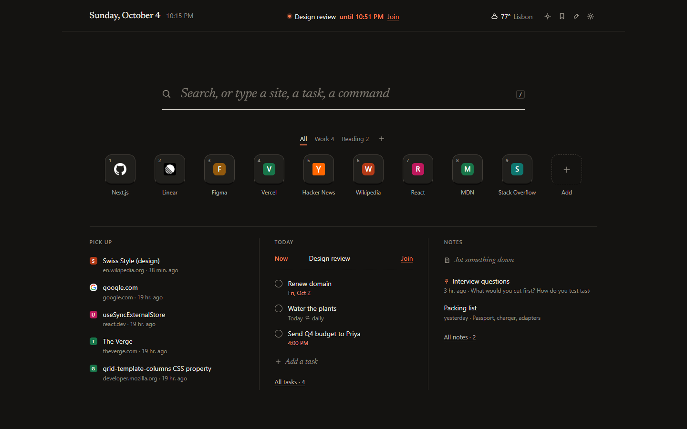

# LiveDash

**The front page of your browser.** A new tab that does everything Chrome's does, then gets out of the way.

One serif search line that reaches the web, your open tabs, history, bookmarks, shortcuts, tasks and notes. Shortcut keys you can group, drag and number. Beneath them, three quiet columns: what to pick up, what's on today, and your notes. Weather, a picture of the day and focus mode are there when you want them. Nothing leaves your browser unless you ask it to.



## What it does

**Immediately**
- **Search that knows your browser.** Type two letters and the top hit is the tab you already have open (it switches, never duplicates), the site you visit at this hour, or a bookmark. Addresses open. Everything else searches with the engine you choose. Site keywords like `yt jazz` or `w typography` go straight to that site.
- **Shortcut keys, better than tiles.** Up to 9 numbered keys (<kbd>Alt</kbd> <kbd>1</kbd>…<kbd>9</kbd>), plus as many more as you like. Groups as tabs, drag to reorder or drop onto a group, your own icon or a coloured letter, a right-click menu, and keyboard editing. Open a whole group as a Chrome tab group. No empty slots: when you have room, faded keys suggest sites from your history, and each one can be dismissed.
- **Pick up.** Tabs and windows you just closed, pages open on your other devices, and today's history, minus the junk (search results, sign-in flows, error pages).

**Discoverable**
- **Today.** Your next meeting with a join link, then due, upcoming and repeating tasks with natural-language dates ("pay rent every month on the 1st", "call mom friday 6pm"). Overdue items are marked, completion has undo, and repeating tasks roll forward.
- **Notes.** Jot from the page, pin the important ones, search them all.
- **Bookmarks.** Browse folders, search, open, or turn any bookmark into a shortcut.
- **Weather.** Pick a city or use your location. You get the current conditions, 12 hours and 5 days, with an "updated" time and an offline state.

**For power users**
- **Commands.** Press <kbd>></kbd> for every action: themes, focus, reopen, close duplicates, open a group as a tab group, export and more.
- **Everything has a key**, and every list works with the keyboard alone. Press <kbd>?</kbd> to see them.

**Optional**
- **Focus mode.** A full-screen timer with 15, 25, 50 and 90-minute presets, breaks and an intent line. It keeps running when you leave.
- **Make it yours.** Light, dark or system. Five accents. Six paper tones, the Wikipedia picture of the day (credited and licensed) or your own photo with a dim control. Comfortable or compact density, serif or sans headlines, 12/24h, long or short dates, and a switch for every column.

| | |
|---|---|
|  |  |
|  |  |
|  |  |
|  |  |

## Keys

| | |
|---|---|
| Search from anywhere on the page | <kbd>/</kbd> |
| Commands | <kbd>></kbd> |
| Open shortcut 1–9 | <kbd>Alt</kbd> <kbd>1</kbd>…<kbd>9</kbd> |
| Open a result in a new tab | <kbd>Alt</kbd> <kbd>↵</kbd> |
| Add what you typed as a task | <kbd>⇧</kbd> <kbd>↵</kbd> |
| Search the web for what you typed | <kbd>Ctrl</kbd> <kbd>↵</kbd> |
| More actions for a result or shortcut | <kbd>→</kbd> or right-click |
| Focus mode · Bookmarks · Tasks · Notes | <kbd>F</kbd> · <kbd>B</kbd> · <kbd>T</kbd> · <kbd>N</kbd> |
| Customize · Settings · All keys | <kbd>C</kbd> · <kbd>,</kbd> · <kbd>?</kbd> |
| Undo | <kbd>Ctrl</kbd> <kbd>Z</kbd> |
| Quick capture on any page | <kbd>Alt</kbd> <kbd>Shift</kbd> <kbd>L</kbd> |

Single-letter keys work when the cursor isn't in a text box. Press <kbd>Esc</kbd> first.

## Privacy

LiveDash has no account, no server, no analytics and no remote code. Access to history, tabs, other devices, bookmarks and top sites is optional and asked for in context, with an explanation. Without it, LiveDash still searches, keeps shortcuts, tasks and notes, and learns from what you open through it. Weather and the picture of the day are off until you turn them on. See [PRIVACY.md](PRIVACY.md).

## Build from source

Requires Node.js 22.6+ and Chrome 120+.

```bash
git clone https://github.com/Mahan-Imanian/LiveDash.git
cd LiveDash
npm ci
npm run build
```

Open `chrome://extensions`, turn on **Developer mode**, choose **Load unpacked** and select `.output/chrome-mv3`.

| Command | What it does |
|---|---|
| `npm run dev` | Development build with live reload |
| `npm run build` | Production build in `.output/chrome-mv3` |
| `npm run zip` | Store-ready zip in `.output/` |
| `npm run check` | Type check, lint and unit tests |

`LD_TEST=1 npx wxt build` produces a test build in `.output-test/` that has the optional permissions granted up front. It is for automated testing only.

## Project layout

```text
entrypoints/              new tab, quick-capture popup, background service worker
src/app/                  page shell, keys, popup
src/features/search/      the search line, result model, commands
src/features/shortcuts/   keys, groups, editor
src/features/front/       masthead, pick up, today, notes
src/features/panels/      bookmarks, tasks, notes, customize, settings
src/lib/rank.ts           ranking: frequency, recency, hour of day, learned picks, title cleanup
src/lib/when.ts           natural-language dates and repeats
src/lib/ics.ts            iCal parsing with recurrence and meeting links
src/store/                local store, actions, import/export, migration
src/ui/                   drawer, menu, glyphs, controls
tests/                    unit tests (node --test)
```

## Origins

LiveDash 1.x was built on a fork of [Widgetify](https://github.com/widgetify-app/widgetify-extension), an open-source new-tab extension released under the MIT License (© 2025 widgetify). The current version is a ground-up rewrite that shares no code with it. The original copyright notice is kept in [LICENSE](LICENSE), as the MIT License requires. Bundled third-party licenses, including the Newsreader typeface (SIL Open Font License), are in [public/THIRD_PARTY_NOTICES.txt](public/THIRD_PARTY_NOTICES.txt).

## License

MIT. See [LICENSE](LICENSE).
