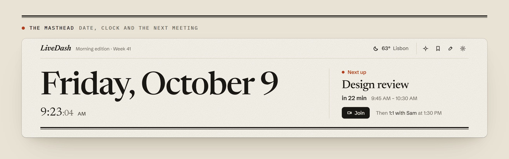
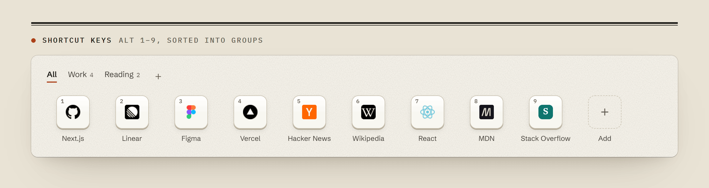
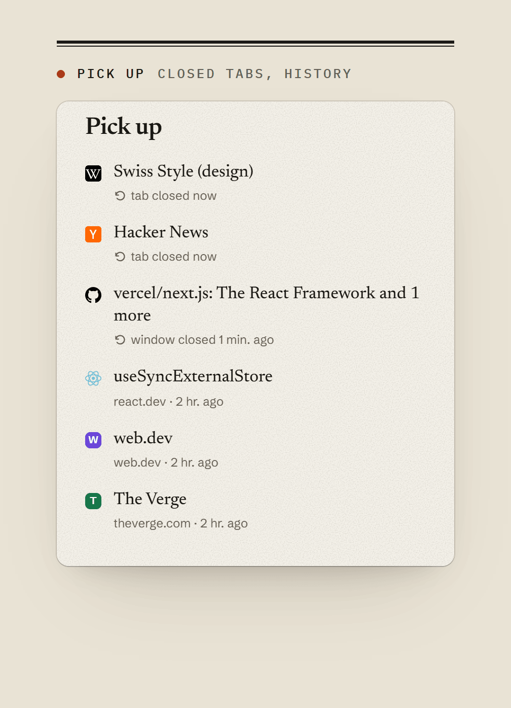
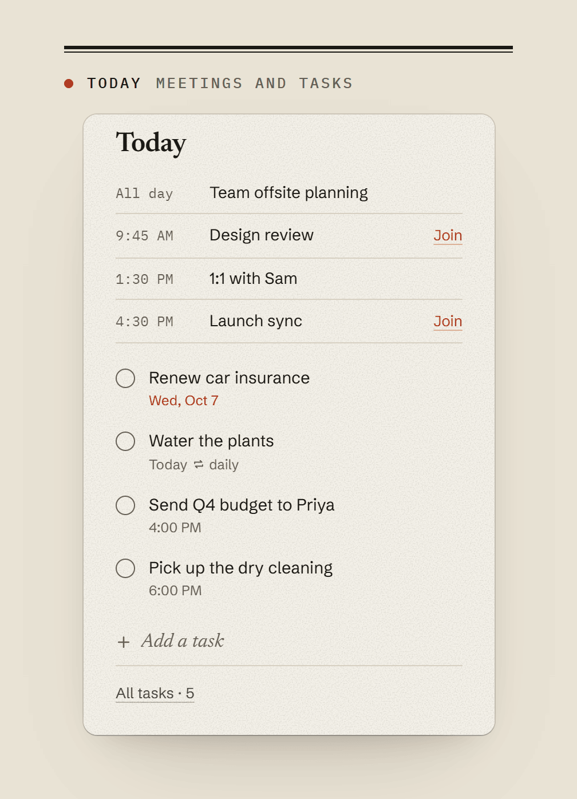

<picture>
  <source media="(prefers-color-scheme: dark)" srcset=".github/assets/cover-dark.png">
  
</picture>

<p align="center">
  <a href="https://github.com/Mahan-Imanian/LiveDash/actions/workflows/ci.yml"></a>
  <a href="LICENSE"></a>
  
  
</p>

<p align="center">
  <a href="#install"><b>Install</b></a> ·
  <a href="#search">Search</a> ·
  <a href="#shortcut-keys">Shortcuts</a> ·
  <a href="#today-pick-up-and-notes">Today</a> ·
  <a href="#keys">Keys</a> ·
  <a href="#how-it-works">How it works</a> ·
  <a href="#privacy">Privacy</a>
</p>

<br>


LiveDash is a Chrome new-tab extension (Manifest V3, React 19, built with WXT). The page has one search box that looks through your open tabs, history, bookmarks, tabs on other devices, tasks and notes before falling back to a web search, a row of shortcut keys, and three columns: recently closed pages, today's tasks and calendar events, and notes. There is no account and no server; everything is computed in the browser from data Chrome already has, and the optional browser permissions are requested only when you turn on the feature that needs them.

## Masthead

The top of the page shows today's date as the headline with a live clock under it. Next to it is the current or next calendar event (one starting within three hours or later today) with a countdown, its time range, a Join button when the event contains a Google Meet, Zoom, Teams, Whereby, Webex, Around or Jitsi link, and the event after it. Without such an event it shows the number of tasks due, or a link to connect a calendar. The line above names the time of day (morning, afternoon, evening or late) and the ISO week number. Dark mode has its own palette rather than an inverted light theme.

<picture>
  <source media="(prefers-color-scheme: dark)" srcset=".github/assets/f-masthead-dark.png">
  
</picture>

## Search

Results are grouped as open tabs, shortcuts, history, bookmarks, other devices, tasks, notes and commands. The top hit is picked in this order:

1. A site keyword: `yt jazz` searches YouTube, `w typography` Wikipedia. Keywords are editable in Settings.
2. Something that looks like an address opens directly.
3. Text containing a date, such as "call mom friday 6pm", becomes a task, unless a page matches strongly. <kbd>⇧</kbd> <kbd>↵</kbd> adds any text as a task.
4. A page whose title or site name matches well. If it is already open, the top hit switches to that tab instead of opening a duplicate.
5. A command whose name matches well.
6. Otherwise, a web search with the engine chosen in Settings. Questions ("how …", "… ?") skip steps 4 and 5.

Page results are ranked by text match, visit count, whether the page is pinned or open, and which result you picked before for the same letters. [docs/ranking.md](docs/ranking.md) lists every term and constant.

<picture>
  <source media="(prefers-color-scheme: dark)" srcset=".github/assets/f-search-dark.png">
  
</picture>

<picture>
  <source media="(prefers-color-scheme: dark)" srcset=".github/assets/f-quick-task-dark.png">
  
</picture>

## Shortcut keys

Nine numbered keys open with <kbd>Alt</kbd> <kbd>1</kbd>…<kbd>9</kbd>; further keys are unnumbered. Keys can be sorted into groups, dragged, given a site icon, a coloured letter or an uploaded image, and a group can be opened as a Chrome tab group. Empty slots show faded suggestions ranked from your history; each can be dismissed, and suggestions can be turned off in Settings.

<picture>
  <source media="(prefers-color-scheme: dark)" srcset=".github/assets/f-keys-dark.png">
  
</picture>

## Today, Pick up and Notes

**Today** lists calendar events next to your tasks. Events come from a secret iCal address pasted into **Settings → Calendar**; the file is fetched again when it is more than 15 minutes old, and events from today through the next 15 days are kept. Tasks are typed as phrases ("pay rent every month on the 1st", "call mom friday 6pm"); overdue ones are marked, every completion can be undone, and repeating tasks move to their next date when completed.

**Pick up** shows up to six entries: recently closed tabs and windows, pages open on your other signed-in devices, then pages from the last 24 hours of history, with search result pages, sign-in pages and error pages filtered out. **Notes** holds plain-text notes; pinned ones stay on top.

<p align="center">
  <picture>
    <source media="(prefers-color-scheme: dark)" srcset=".github/assets/f-pickup-dark.png">
    
  </picture>
  <picture>
    <source media="(prefers-color-scheme: dark)" srcset=".github/assets/f-today-dark.png">
    
  </picture>
</p>

## Commands and optional panels

<kbd>></kbd> opens a command list (theme, focus timer, reopen the last closed tab, close duplicate tabs, open a group as a tab group, export data). <kbd>?</kbd> lists every key. Weather (Open-Meteo), a full-screen focus timer and Wikipedia's picture of the day as background are off until you turn them on. Customize covers light, dark or system theme, five accents, six paper tones or a photo, density, serif or sans headlines, and a switch for each column.

<picture>
  <source media="(prefers-color-scheme: dark)" srcset=".github/assets/f-commands-dark.png">
  
</picture>

<p align="center">
  <picture>
    <source media="(prefers-color-scheme: dark)" srcset=".github/assets/f-weather-dark.png">
    
  </picture>
  <picture>
    <source media="(prefers-color-scheme: dark)" srcset=".github/assets/f-customize-dark.png">
    
  </picture>
</p>

<picture>
  <source media="(prefers-color-scheme: dark)" srcset=".github/assets/f-focus-dark.png">
  
</picture>

## Install

LiveDash is not on the Chrome Web Store. Build it once and load it unpacked. You need Chrome 120+ and Node.js 22.18+.

```bash
git clone https://github.com/Mahan-Imanian/LiveDash.git
cd LiveDash
npm ci
npm run build
```

Open `chrome://extensions`, turn on **Developer mode**, choose **Load unpacked** and select `.output/chrome-mv3`, then open a new tab. `npm run zip` builds a packed copy at `.output/livedash-<version>-chrome.zip`.

## Keys

| Action | Key |
| --- | --- |
| Search from anywhere on the page | <kbd>/</kbd> |
| Commands | <kbd>></kbd> |
| Open shortcut 1–9 | <kbd>Alt</kbd> <kbd>1</kbd>…<kbd>9</kbd> |
| Open a result in a new tab | <kbd>Alt</kbd> <kbd>↵</kbd> |
| Add what you typed as a task | <kbd>⇧</kbd> <kbd>↵</kbd> |
| Search the web for what you typed | <kbd>Ctrl</kbd> <kbd>↵</kbd> |
| More actions for a result or shortcut | <kbd>→</kbd> or right-click |
| Focus mode · Bookmarks · Tasks · Notes | <kbd>F</kbd> · <kbd>B</kbd> · <kbd>T</kbd> · <kbd>N</kbd> |
| Customize · Settings · All keys | <kbd>C</kbd> · <kbd>,</kbd> · <kbd>?</kbd> |
| Undo | <kbd>Ctrl</kbd> <kbd>Z</kbd> |
| Quick capture on any page | <kbd>Alt</kbd> <kbd>Shift</kbd> <kbd>L</kbd> |

Single-letter keys work when the cursor is not in a text box; press <kbd>Esc</kbd> first.

## How it works

| Part | Files | What it does |
| --- | --- | --- |
| Entry points | `entrypoints/newtab`, `entrypoints/popup`, `entrypoints/background.ts` | The new tab, the quick-capture popup (<kbd>Alt</kbd> <kbd>Shift</kbd> <kbd>L</kbd>), and a service worker that runs focus-timer alarms, the toolbar badge and the right-click menu items. |
| Store and sync | `src/store/` | One in-memory state object. Each key is saved to `chrome.storage.local`, except settings, which go to `chrome.storage.sync`. `storage.onChanged` pushes changes to every open LiveDash tab, so two new tabs never disagree. `data.ts` handles export, import, erase and the one-time 1.x migration. |
| Browser data and permissions | `src/lib/browser.ts`, `src/features/snapshot.ts`, `src/lib/chrome.ts` | Reads open tabs, history, recently closed sessions, other devices and bookmarks, each only if its optional permission is granted, and re-reads when the page becomes visible or a permission changes. |
| Search and ranking | `src/lib/rank.ts`, `src/lib/fuzzy.ts`, `src/features/search/model.ts` | Merges all sources into one entry per page, filters noise, scores entries for the home suggestions and for typed queries, and builds the result rows. See [docs/ranking.md](docs/ranking.md). |
| Date phrases | `src/lib/when.ts` | Turns "call mom friday 6pm" or "pay rent every month on the 1st" into a title, a due time and an optional repeat, and computes the next date of a repeating task. |
| Calendar | `src/lib/ics.ts`, `src/features/calendar.ts` | Fetches the iCal file (host permission for that one origin), unfolds and parses it, expands recurrences into the next 15 days, applies exceptions and finds meeting links. |
| Network features | `src/features/weather.ts`, `src/lib/daily.ts` | Open-Meteo weather and Wikipedia's picture of the day, each behind its own host permission, with a 10-second timeout. |
| Design tokens | `src/styles/tokens.css` | Colours, type, spacing and motion for every theme, tone and accent. |

## Design decisions

**No date or calendar library.** `when.ts` and `ics.ts` are small hand-written parsers. The extension needs English task phrases and the subset of iCal that Google Calendar, Outlook and Apple Calendar export, and a general library for either would be larger than the rest of the logic. The cost is that every edge case has to be found and tested here: impossible dates, leap years, daylight-saving changes, folding, escapes and recurrence rules are covered in `tests/when.test.ts`, `tests/when-dst.test.ts` and `tests/ics.test.ts`, and the gaps are listed under Known limits.

**Ranking runs locally with hand-set weights.** Visits, recency, hour of day and past picks are combined in `rank.ts` from data Chrome already stores, so nothing about your browsing leaves the device and nothing needs a server. The weights were chosen by hand and never measured against real usage; `docs/ranking.md` states each one, and `tests/rank.test.ts` fixes the orderings they are supposed to produce.

**Optional permissions.** Only `storage`, `search`, `favicon`, `alarms`, `contextMenus` and `activeTab` are required. History, tabs, sessions, bookmarks, top sites, tab groups, notifications and each network host are requested when you turn on the feature that uses them. Browser permissions are removed with their switch in Settings, and calendar and weather host access is removed when you disconnect them; access to Wikipedia stays granted after you switch away from the picture of the day until you remove it in `chrome://extensions`. Without them LiveDash still searches the web and keeps shortcuts, tasks and notes. The cost is extra code paths for missing access and a permission prompt the first time a feature is used.

**Settings sync, data stays local.** Settings are small and go to `chrome.storage.sync`, so they follow you when Chrome Sync is on. Tasks, notes, shortcuts, the launch log and caches stay in `chrome.storage.local` on one device; moving them is done with export and import.

**Taking focus from the address bar.** Chrome gives new-tab pages no keyboard focus. To let you type into LiveDash's search box straight away, the page reloads itself once as `newtab.html?f`, which Chrome does focus. This costs one extra load per new tab and can be turned off in Settings → Search ("Start typing right away").

**Fonts are bundled.** Newsreader, Schibsted Grotesk and IBM Plex Mono ship inside the extension (about 270 KB of WOFF2) so that the page makes no font requests.

## Known limits

- Date phrases are English only. Supported: today, tonight, tomorrow, weekdays, "next week", "weekend", month-name dates, ISO dates, "the 5th", "in N minutes/hours/days/weeks", clock and am/pm times, and daily, weekday, weekly, monthly and yearly repeats. Not supported: "in 2 months", ranges, durations and time zones.
- iCal: `DAILY`, `WEEKLY` with `BYDAY`, `MONTHLY` with `BYDAY` or `BYMONTHDAY`, and `YEARLY` are expanded. Rules with `BYSETPOS`, `BYWEEKNO`, `BYYEARDAY`, `BYHOUR` or other combinations show only their first occurrence. `WKST` is ignored (weeks start on Sunday). Recurrences are expanded in your own time zone, so an event defined in a zone whose daylight-saving dates differ from yours can be an hour off for part of the year. Windows zone names such as `Pacific Standard Time` are not recognised and are read as local time.
- Something with a dot and two or more letters after it, such as `node.js`, is treated as an address; the web search row is still one key down.
- The ranking weights are not validated against anyone's usage.
- Chrome only. LiveDash uses Chrome APIs (`favicon`, `sessions`, `tabGroups`, `search`) that other browsers lack or implement differently.

## Privacy

No account, no server, no analytics, no remote code. Optional permissions are requested when you turn on the feature that needs them and can be turned off again in Settings. Without any of them, LiveDash still searches and keeps your shortcuts, tasks and notes.

| Permission | Used for |
| --- | --- |
| `storage` | Shortcuts, tasks, notes and settings |
| `search` | Sending a search to Chrome's default engine |
| `favicon` | Site icons from Chrome's own cache |
| `alarms` | Ending a focus session on time with no tab open |
| `contextMenus` | "Save for later" and "Pin to LiveDash" on right-click |
| `activeTab` | The current page's address for quick capture |
| `history` (optional) | Ranking results, suggesting shortcuts, today's history |
| `tabs` (optional) | Switching to an open tab, closing duplicates |
| `sessions` (optional) | Recently closed tabs, pages on your other devices |
| `bookmarks` (optional) | Browsing and searching bookmarks |
| `topSites` (optional) | Importing your most visited sites as shortcuts, once |
| `tabGroups` (optional) | Opening a shortcut group as a tab group |
| `notifications` (optional) | Saying when a focus session ends |
| `https://*/*` (optional) | The hosts below, each requested when you turn its feature on |

Network requests, all opt-in and sent without cookies:

- **Weather:** `geocoding-api.open-meteo.com` and `api.open-meteo.com`. "Use my location" rounds your position to two decimal places (about 1 km) first.
- **Picture of the day:** `en.wikipedia.org` and `upload.wikimedia.org`, once a day.
- **Calendar:** the iCal address you paste in, at most every 15 minutes.
- **Searches** go to the engine you picked.

Everything else stays in local extension storage, except settings, which use `chrome.storage.sync` and so travel through your Google account when Chrome Sync is on. Details in [PRIVACY.md](PRIVACY.md).

## Development

```bash
npm run dev     # live-reloading build in a Chrome instance
npm run check   # type check, Biome lint and format, unit tests
npm run build   # production build in .output/chrome-mv3
```

The unit tests run TypeScript directly with `node --test` and need Node.js 22.18+. What they cover:

| Test | Covers |
| --- | --- |
| `tests/when.test.ts`, `tests/when-dst.test.ts` | Date phrases, impossible and boundary dates and times, repeats, and daylight-saving changes (run in `America/New_York`) |
| `tests/ics.test.ts`, `tests/lib.test.ts` | iCal values, folding, escapes, time zones, malformed input, recurrence, meeting links; URL detection and fuzzy matching |
| `tests/rank.test.ts` | Page identity, merging, filters and the orderings the ranking constants are meant to produce |
| `tests/edition.test.ts` | Masthead event choice, week numbers and time-of-day names |
| `tests/contrast.test.ts` | WCAG contrast of text tokens for all 180 combinations of system scheme, theme, paper tone and accent, and that each accent takes effect |

`node --test tests/contrast.test.ts` prints the lowest ratio it found; at the time of writing it is 4.90:1 (`--accent` on `--bg`, clay tone, ember accent, light theme), and every pair it checks is at least 4.5:1 (AA for body text). It checks `--ink-1`, `--ink-2`, `--ink-3`, `--accent` and `--danger` on `--bg` and `--surface`, and `--accent-ink` on `--accent`. It does not cover photo backgrounds, the paper grain overlay, or colours set outside `tokens.css`.

Layout at different widths and zoom levels, keyboard-only use and loading speed have been checked by hand only; there are no browser tests in CI. The CHANGELOG records what was checked for each release and how. Project layout and ground rules are in [CONTRIBUTING.md](.github/CONTRIBUTING.md).

## License

MIT, see [LICENSE](LICENSE). Bundled third-party licenses, including the fonts (SIL Open Font License), are in [public/THIRD_PARTY_NOTICES.txt](public/THIRD_PARTY_NOTICES.txt).
