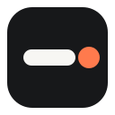
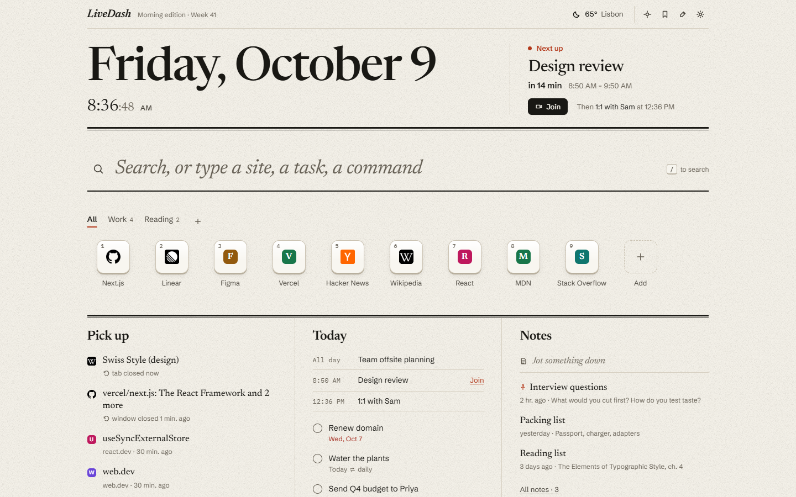
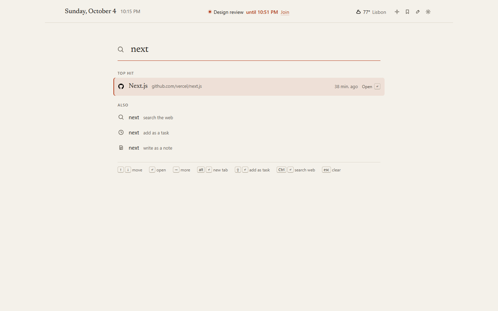
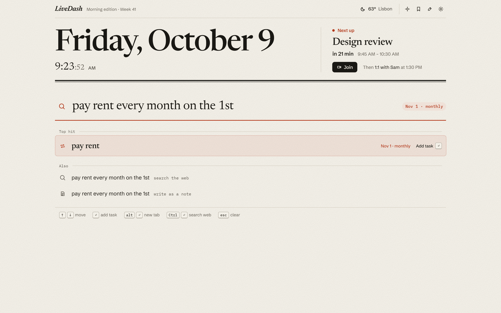
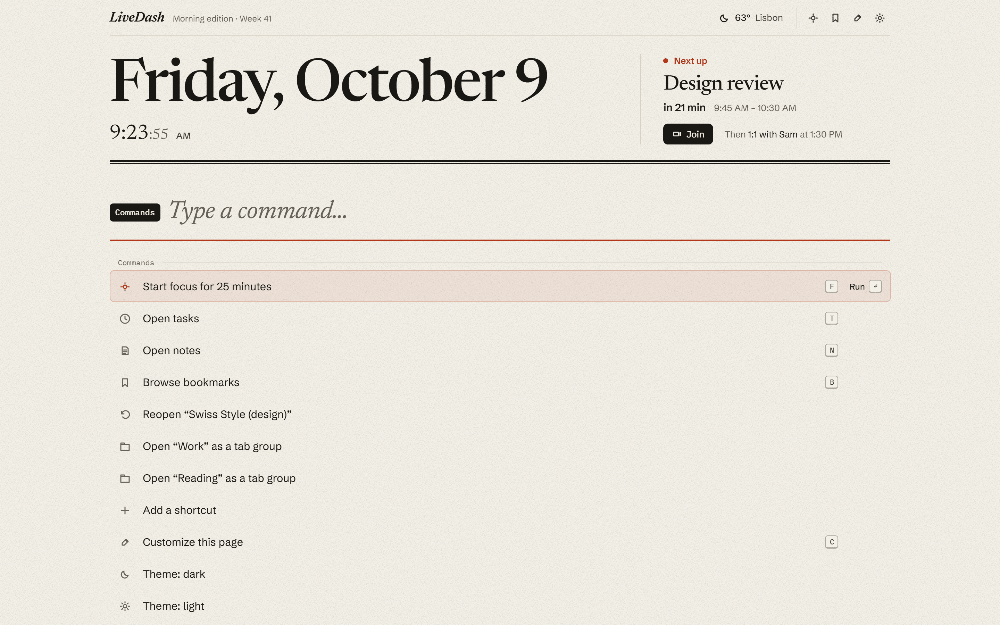
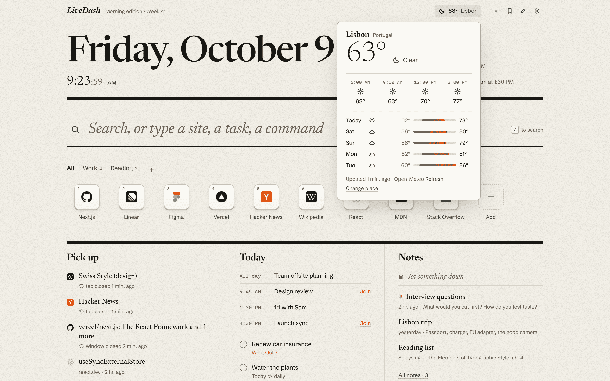
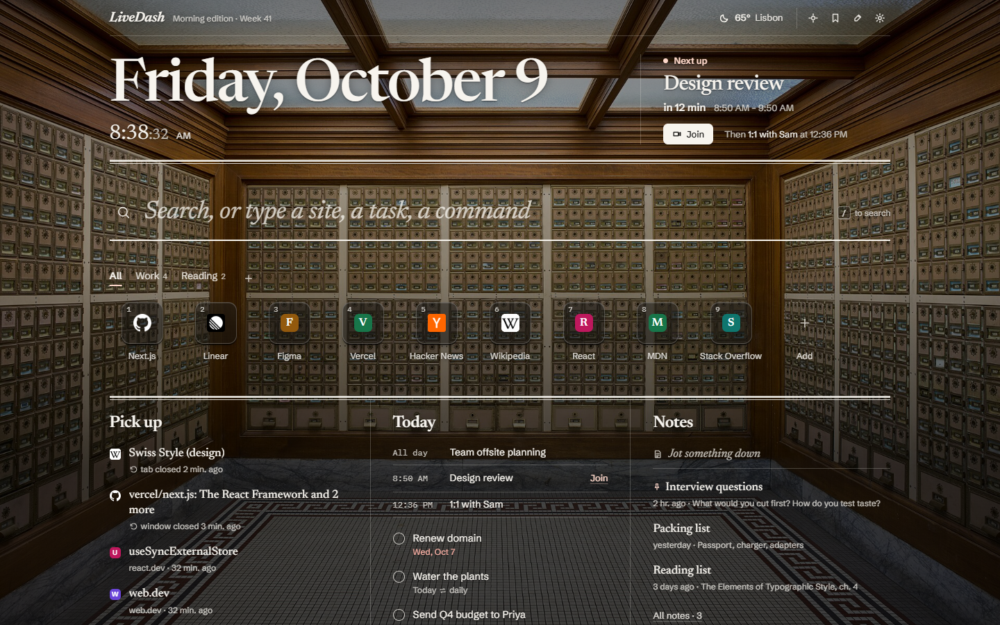
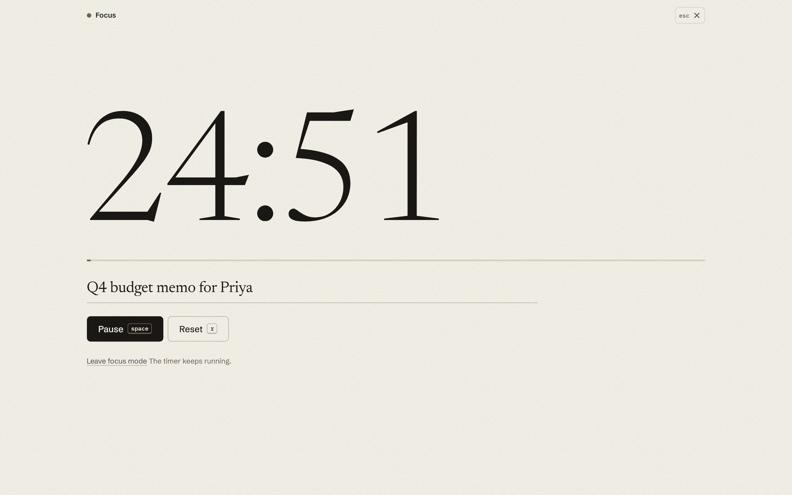
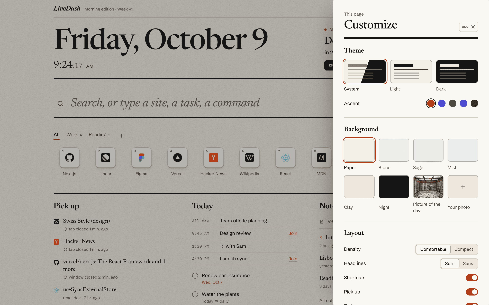
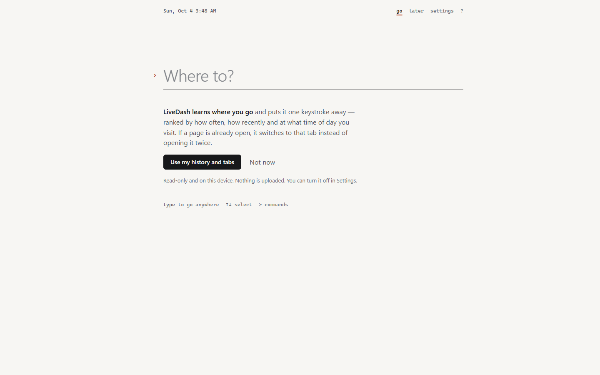

#  LiveDash

**The front page of your browser.** A Chrome new tab that searches your tabs, history and bookmarks, and keeps your day on one page.

[](https://github.com/Mahan-Imanian/LiveDash/actions/workflows/ci.yml) [](LICENSE)

One serif search line that reaches the web, your open tabs, history, bookmarks, shortcuts, tasks and notes. Shortcut keys you can group, drag and number. Beneath them, three quiet columns: what to pick up, what's on today, and your notes. Weather, a picture of the day and focus mode are there when you want them. There is no account, server or analytics, and LiveDash only goes online for your searches and the extras you switch on.

<picture>
  <source media="(prefers-color-scheme: dark)" srcset="docs/screenshots/front-dark.png">
  
</picture>

## Install

LiveDash isn't on the Chrome Web Store, so you build it once and load it unpacked. You need Chrome 120+ and Node.js 22.18+.

```bash
git clone https://github.com/Mahan-Imanian/LiveDash.git
cd LiveDash
npm ci
npm run build
```

Open `chrome://extensions`, turn on **Developer mode**, choose **Load unpacked** and select `.output/chrome-mv3`. Open a new tab. `npm run zip` builds a packed copy at `.output/livedash-<version>-chrome.zip`.

## What it does

**Immediately**
- **Search that knows your browser.** Type two letters and the top hit is the tab you already have open (it switches, never duplicates), the site you visit at this hour, or a bookmark. Addresses open. Everything else searches with the engine you choose. Site keywords like `yt jazz` or `w typography` go straight to that site.
- **Shortcut keys, better than tiles.** Up to 9 numbered keys (<kbd>Alt</kbd> <kbd>1</kbd>…<kbd>9</kbd>), plus as many more as you like. Groups as tabs, drag to reorder or drop onto a group, your own icon or a coloured letter, a right-click menu, and keyboard editing. Open a whole group as a Chrome tab group. No empty slots: when you have room, faded keys suggest sites from your history, and each one can be dismissed.
- **Pick up.** Tabs and windows you just closed, pages open on your other devices, and today's history, minus the junk (search results, sign-in flows, error pages).

**Discoverable**
- **Today.** Your next meeting with a join link, then due, upcoming and repeating tasks with natural-language dates ("pay rent every month on the 1st", "call mom friday 6pm"). Overdue items are marked, completion has undo, and repeating tasks roll forward. Meetings appear once you paste your calendar's secret iCal link into **Settings → Calendar**.
- **Notes.** Jot from the page, pin the important ones, search them all.
- **Bookmarks.** Browse folders, search, open, or turn any bookmark into a shortcut.
- **Weather.** Pick a city or use your location. You get the current conditions, 12 hours and 5 days, with an "updated" time and an offline state.

**For power users**
- **Commands.** Press <kbd>></kbd> for every action: themes, focus, reopen, close duplicates, open a group as a tab group, export and more.
- **Everything has a key**, and every list works with the keyboard alone. Press <kbd>?</kbd> to see them.

**Optional**
- **Focus mode.** A full-screen timer with 15, 25, 50 and 90-minute presets, breaks and an intent line. It keeps running when you leave.
- **Make it yours.** Light, dark or system. Five accents. Six paper tones, the Wikipedia picture of the day (credited and licensed) or your own photo with a dim control. Comfortable or compact density, serif or sans headlines, 12/24h, long or short dates, and a switch for every column.

| | |
|---|---|
|  |  |
|  |  |
|  |  |
|  |  |

## Keys

| | |
|---|---|
| Search from anywhere on the page | <kbd>/</kbd> |
| Commands | <kbd>></kbd> |
| Open shortcut 1–9 | <kbd>Alt</kbd> <kbd>1</kbd>…<kbd>9</kbd> |
| Open a result in a new tab | <kbd>Alt</kbd> <kbd>↵</kbd> |
| Add what you typed as a task | <kbd>⇧</kbd> <kbd>↵</kbd> |
| Search the web for what you typed | <kbd>Ctrl</kbd> <kbd>↵</kbd> |
| More actions for a result or shortcut | <kbd>→</kbd> or right-click |
| Focus mode · Bookmarks · Tasks · Notes | <kbd>F</kbd> · <kbd>B</kbd> · <kbd>T</kbd> · <kbd>N</kbd> |
| Customize · Settings · All keys | <kbd>C</kbd> · <kbd>,</kbd> · <kbd>?</kbd> |
| Undo | <kbd>Ctrl</kbd> <kbd>Z</kbd> |
| Quick capture on any page | <kbd>Alt</kbd> <kbd>Shift</kbd> <kbd>L</kbd> |

Single-letter keys work when the cursor isn't in a text box. Press <kbd>Esc</kbd> first.

## Privacy and permissions

No account, no server, no analytics, no remote code. Optional permissions are asked for in context and can be turned off in Settings. Without them, LiveDash still searches and keeps shortcuts, tasks and notes.

| Permission | Why |
|---|---|
| `storage` | Save shortcuts, tasks, notes and settings |
| `search` | Send a search to Chrome's default engine |
| `favicon` | Show site icons from Chrome's own cache |
| `alarms` | End a focus session on time with no tab open |
| `contextMenus` | "Save for later" and "Pin to LiveDash" on right-click |
| `activeTab` | Read the current page's address for quick capture |
| `history` (optional) | Rank results, suggest shortcuts, show today's history |
| `tabs` (optional) | Switch to an open tab, close duplicates |
| `sessions` (optional) | Recently closed tabs, pages on your other devices |
| `bookmarks` (optional) | Browse and search bookmarks |
| `topSites` (optional) | Import your most visited sites as shortcuts, once |
| `tabGroups` (optional) | Open a shortcut group as a tab group |
| `notifications` (optional) | Say when a focus session ends |
| `https://*/*` (optional) | Reach the hosts below, each asked for when you turn its feature on |

Network requests, all opt-in and sent without cookies:

- **Weather:** `geocoding-api.open-meteo.com` and `api.open-meteo.com`. "Use my location" rounds your position to about 1 km first.
- **Picture of the day:** `en.wikipedia.org` and `upload.wikimedia.org`, once a day.
- **Calendar:** the iCal address you paste in, at most every 15 minutes.
- **Searches** go to the engine you picked.

Everything else stays in local extension storage, except settings: they use `chrome.storage.sync`, so Chrome copies them through your Google account when Chrome Sync is on. Details in [PRIVACY.md](PRIVACY.md).

## Development

`npm run check` (type check, lint, unit tests) needs Node.js 22.18+, because the tests run TypeScript directly with `node --test`. `npm run dev` gives a live-reloading build. The project layout and ground rules are in [CONTRIBUTING.md](.github/CONTRIBUTING.md).

## Origins

LiveDash 1.x was built on a fork of [Widgetify](https://github.com/widgetify-app/widgetify-extension), an open-source new-tab extension released under the MIT License (© 2025 widgetify). The current version is a ground-up rewrite that shares no code with it. The original copyright notice is kept in [LICENSE](LICENSE), as the MIT License requires. Bundled third-party licenses, including the Newsreader typeface (SIL Open Font License), are in [public/THIRD_PARTY_NOTICES.txt](public/THIRD_PARTY_NOTICES.txt).

## License

MIT. See [LICENSE](LICENSE).
