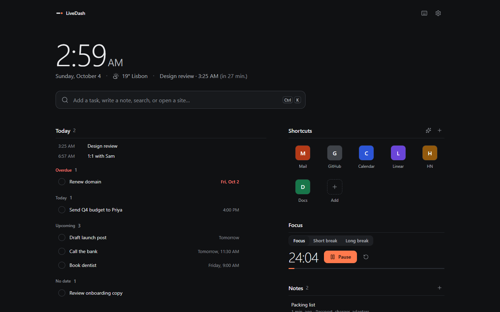
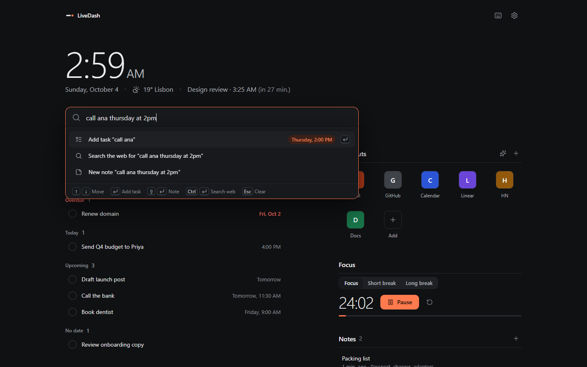
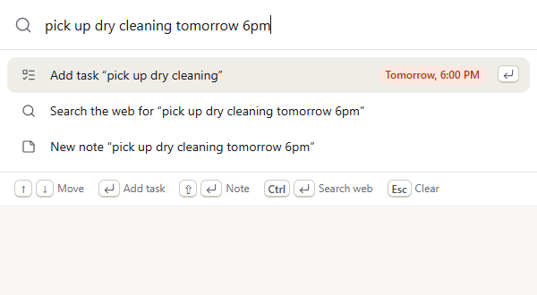
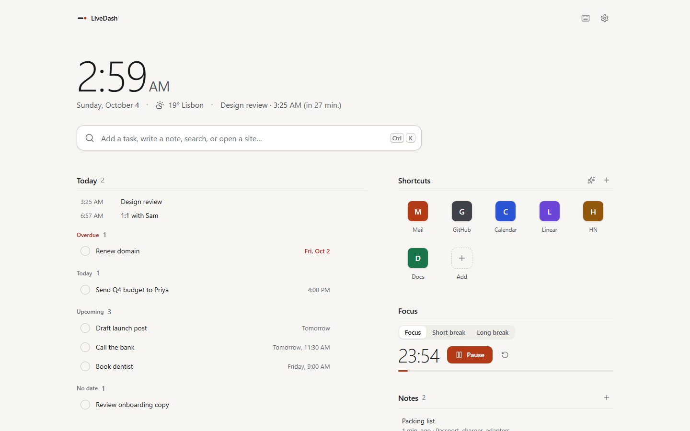
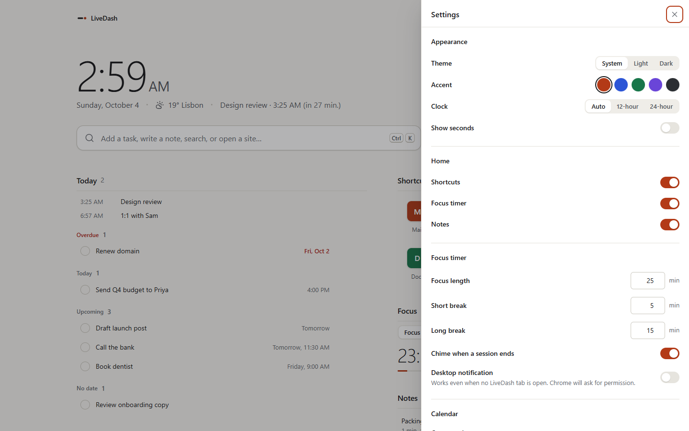

# LiveDash

A fast, private, keyboard-first new tab for Chrome.

Open a tab, see what's next, act on it, get back to work. Capture a task with a date in plain English, jump to any site, jot a note, or start a focus session — all from one box, without an account, and without anything leaving your device.



## What it does

- **One box for everything.** Press <kbd>/</kbd> or <kbd>Ctrl</kbd> <kbd>K</kbd> and type. “Call Alex tomorrow at 3pm” becomes a task due tomorrow at 15:00, and you see how it was understood before you press Enter. The same box opens sites, searches the web with your default engine, finds your shortcuts, notes, tasks and (if you allow it) bookmarks, and runs commands.
- **Quick capture on any page.** <kbd>Alt</kbd> <kbd>Shift</kbd> <kbd>L</kbd> opens a small capture window over whatever you're doing. Add a task, save the page as a note or pin it as a shortcut, and keep going. Right-click selected text to add it as a task.
- **Today, not a dashboard.** Overdue, today, upcoming and undated tasks, grouped and ordered. Complete with a click or <kbd>Space</kbd>, edit with <kbd>Enter</kbd>, reorder with drag or <kbd>Alt</kbd> + arrows, and undo anything with <kbd>Ctrl</kbd> <kbd>Z</kbd>.
- **Shortcuts that start full.** Suggestions come from Chrome's own most-visited list (only if you allow it). Open them with a click or keys <kbd>1</kbd>–<kbd>9</kbd>. Custom names, letter icons or your own image.
- **Notes that save as you type.** The first line is the title.
- **Focus timer** that starts instantly, survives closing the tab, shows the remaining minutes on the toolbar icon, and notifies you only if you ask it to.
- **Optional context.** Your next calendar event (from any iCal link — Google, Outlook, iCloud) and the weather (Open-Meteo, no key, no account) sit quietly under the clock.

| | |
|---|---|
|  |  |
|  |  |

## Privacy

No account, no analytics, no ads, no remote code. Tasks, notes and shortcuts live in your browser's extension storage. The only network requests are the ones you turn on (weather, calendar), each behind its own Chrome permission prompt. See [PRIVACY.md](PRIVACY.md).

Install-time permissions are limited to storage, alarms, the right-click menu, site icons, search through your default engine, and the current tab when you open quick capture. Bookmarks, most-visited sites, notifications and the weather/calendar hosts are optional and requested only when you use the feature that needs them.

## Build from source

Requires Node.js 22.6+ and Chrome 120+.

```bash
git clone https://github.com/Mahan-Imanian/LiveDash.git
cd LiveDash
npm ci
npm run build
```

Then open `chrome://extensions`, turn on **Developer mode**, choose **Load unpacked** and select `.output/chrome-mv3`.

| Command | What it does |
|---|---|
| `npm run dev` | Development build with live reload in a separate Chrome profile |
| `npm run build` | Production build in `.output/chrome-mv3` |
| `npm run zip` | Store-ready zip in `.output/` |
| `npm run check` | Type check, lint and unit tests |

## Project layout

```text
entrypoints/   newtab page, quick-capture popup, background service worker
src/app/       page shells and boot (store load, theme)
src/features/  command bar, tasks, shortcuts, notes, focus, settings, calendar/weather services
src/lib/       pure logic: natural-language dates, iCal parsing, fuzzy matching, formatting
src/store/     local-first store, actions, import/export, migration from v1
src/styles/    design tokens and component styles
tests/         unit tests (node --test)
```

## Origins

LiveDash 1.x was built on a fork of [Widgetify](https://github.com/widgetify-app/widgetify-extension), an open-source new-tab extension released under the MIT License (© 2025 widgetify). Version 2 is a ground-up rewrite that shares no code with it; the original copyright notice is kept in [LICENSE](LICENSE) as the MIT License requires. Bundled third-party licenses are in [public/THIRD_PARTY_NOTICES.txt](public/THIRD_PARTY_NOTICES.txt).

## License

MIT — see [LICENSE](LICENSE).
