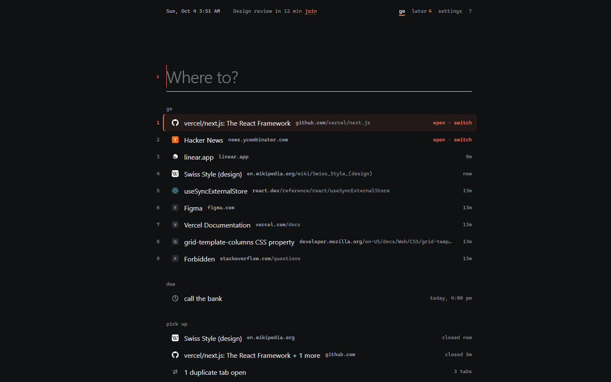
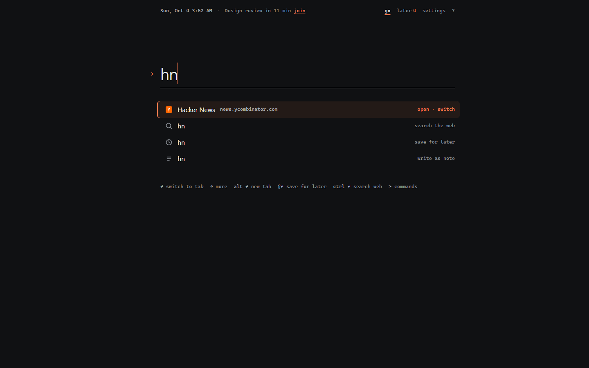
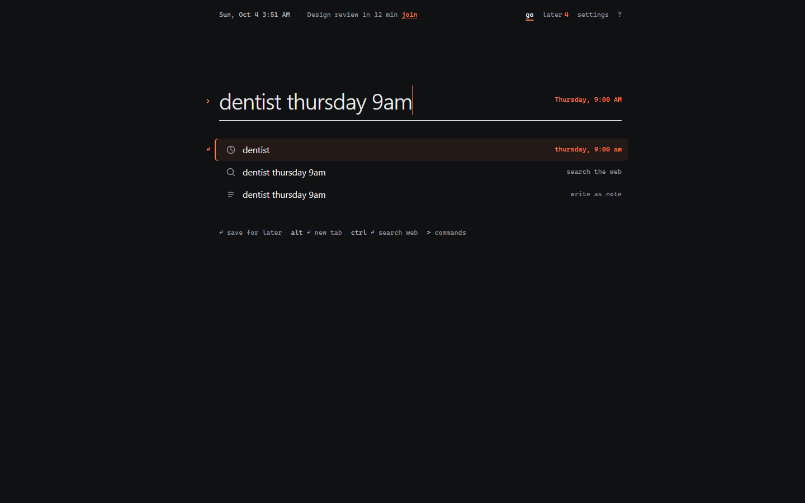
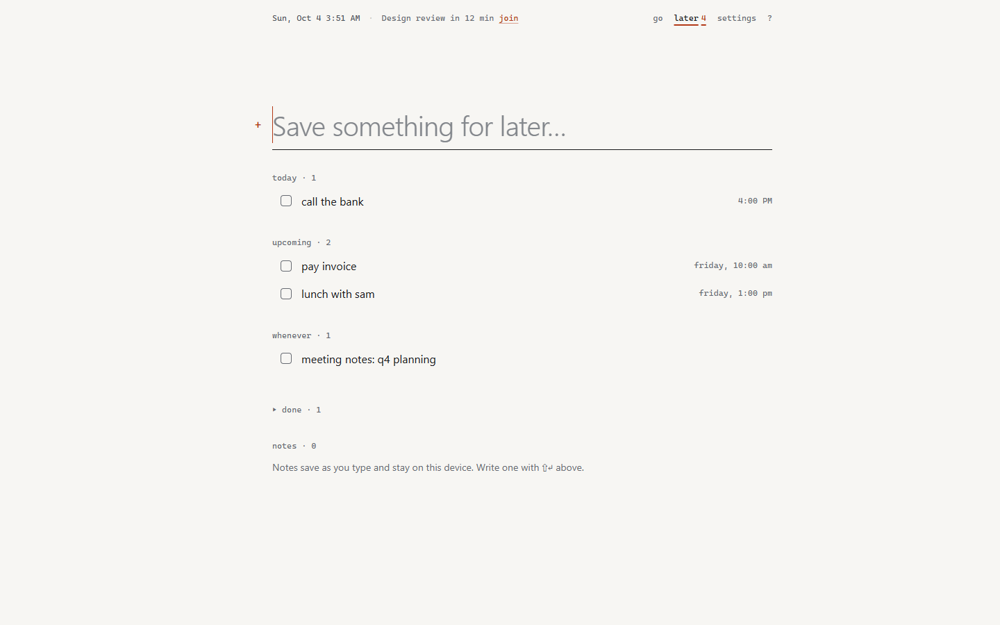

# LiveDash

**Where to?** A new tab that knows where you go.

Open a tab, type two letters or press a number, and you're there. If it's already open somewhere, LiveDash switches to that tab instead of opening it twice. Everything you might want next — the places you visit at this time of day, the tab you just closed, the meeting starting in ten minutes, the thing you saved for later — is one keystroke away. Nothing leaves your browser.



## What it does

- **Learns where you go.** Places are ranked from your own history by how often, how recently and at what hour you visit them, and numbered 1–9. Pick something for a few letters a couple of times and it ranks first for those letters next time. No setup, no bookmarks to curate.
- **Switches instead of duplicating.** Going somewhere you already have open jumps to that tab and closes the new one. One row tells you when you have duplicate tabs and closes them with undo.
- **Picks up where you left off.** Recently closed tabs and windows come back with one key.
- **Understands what you type.** An address opens. A question searches with your default engine. "Dentist thursday 9am" becomes something saved for later with a date. `>` lists commands.
- **Later.** Things to come back to — pages, tasks with dates, notes — on their own quiet page. Save the current page from anywhere with <kbd>Alt</kbd> <kbd>Shift</kbd> <kbd>L</kbd> or the right-click menu.
- **What matters right now, only when it matters.** The next meeting (with a join link) and a running focus timer appear in one line at the top, and disappear when they don't apply.

| | |
|---|---|
|  |  |
|  |  |

## Keys

| | |
|---|---|
| Go to the highlighted row | <kbd>↵</kbd> |
| Open place 1–9 | <kbd>Alt</kbd> <kbd>1</kbd>…<kbd>9</kbd> |
| Open in a new tab | <kbd>Alt</kbd> <kbd>↵</kbd> |
| Save what you typed for later | <kbd>⇧</kbd> <kbd>↵</kbd> |
| Search the web for what you typed | <kbd>Ctrl</kbd> <kbd>↵</kbd> |
| More actions (pin, copy, never suggest…) | <kbd>→</kbd> |
| Commands | <kbd>></kbd> |
| Quick capture on any page | <kbd>Alt</kbd> <kbd>Shift</kbd> <kbd>L</kbd> |

## Privacy

LiveDash has no account, no server, no analytics and no remote code. Ranking happens in your browser from data Chrome already has. Access to history, tabs and recently closed tabs is optional and asked for once, with an explanation; without it LiveDash still launches, searches and saves things, and learns from what you open through it. See [PRIVACY.md](PRIVACY.md).

## Build from source

Requires Node.js 22.6+ and Chrome 120+.

```bash
git clone https://github.com/Mahan-Imanian/LiveDash.git
cd LiveDash
npm ci
npm run build
```

Open `chrome://extensions`, turn on **Developer mode**, choose **Load unpacked** and select `.output/chrome-mv3`.

| Command | What it does |
|---|---|
| `npm run dev` | Development build with live reload |
| `npm run build` | Production build in `.output/chrome-mv3` |
| `npm run zip` | Store-ready zip in `.output/` |
| `npm run check` | Type check, lint and unit tests |

`LD_TEST=1 npx wxt build` produces a test build in `.output-test/` with history and tab access granted up front, for automated testing only.

## Project layout

```text
entrypoints/        new tab, quick-capture popup, background service worker
src/lib/rank.ts     ranking: frequency, recency, hour of day, learned picks, title cleanup
src/lib/browser.ts  history, open tabs, recently closed, duplicates, tab switching
src/lib/when.ts     natural-language dates
src/lib/ics.ts      iCal parsing with recurrence and meeting links
src/features/       launcher, later, settings, top line
src/store/          local store, actions, import/export, migration
tests/              unit tests (node --test)
```

## Origins

LiveDash 1.x was built on a fork of [Widgetify](https://github.com/widgetify-app/widgetify-extension), an open-source new-tab extension released under the MIT License (© 2025 widgetify). The current version is a ground-up rewrite that shares no code with it; the original copyright notice is kept in [LICENSE](LICENSE) as the MIT License requires. Bundled third-party licenses are in [public/THIRD_PARTY_NOTICES.txt](public/THIRD_PARTY_NOTICES.txt).

## License

MIT — see [LICENSE](LICENSE).
